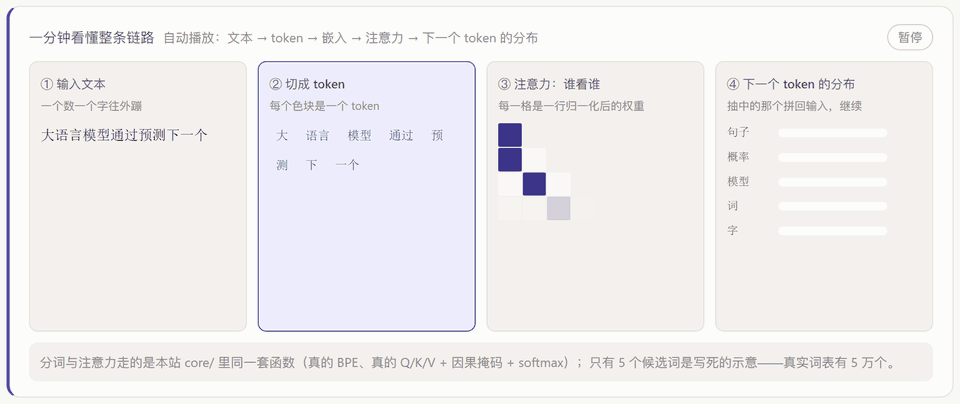

# Inside the LLM — An Interactive Visualization Lab

**Open the black box of a large language model, one module at a time.**

[English](./README_EN.md) · [简体中文](./README.md)

Frontend only · no paid APIs · bilingual (中文 / EN) · responsive · six playable modules · optional real model weights


---

## Live demo

**👉 [https://1690940255ran-dot.github.io/llm-inside-lab/](https://1690940255ran-dot.github.io/llm-inside-lab/)**

No signup, no backend, nothing to install.

The homepage runs an auto-playing pipeline animation (text → tokens → attention → next-token distribution),
and every step is computed by the unit-tested functions in `src/core/`:



---

## What problem does it solve

Material on how LLMs work tends to fall into two buckets: **math derivations** (you follow the symbols but
build no intuition) and **wrapped-up demos** (you drag two sliders and have no idea what is being computed).

This site fills the gap in between — **it lays out the intermediate result of every step, and lets you change
the input and watch everything recompute live**:

- Want to know what temperature actually changes? The candidate table shows **raw p / after temperature /
  after sampling** side by side. Candidates cut by top-k / top-p go grey; candidates merely depressed by
  temperature keep their row with a smaller number.
- Want to know why attention needs multiple heads? Open "all heads of this layer" — a dozen thumbnails with
  completely different patterns. No prose beats seeing that.
- Want to know why Chinese costs more tokens? Paste the same content in Chinese and in English and read the
  token counts.

## Highlights

| | |
| --- | --- |
| **The algorithms are real, not drawn** | BPE merges are counted from actual corpus frequencies; attention runs the full Q/K/V projection → `1/√d_k` scaling → causal mask → softmax; the three sampling knobs match Hugging Face's logits warpers |
| **Optional real weights** | Run SmolLM2 / LFM2 / Qwen3 in your browser (WebGPU, WASM fallback) so temperature / top-k / top-p act on **real logits**, and read the measured KV-cache tensor shapes |
| **Honest about what is simulated** | The homepage and every module state which parts are simulated and which are real. Where something is genuinely impossible in a browser (real attention maps), the site shows the measurement that proves it |
| **No UI or charting library** | Heatmaps are `<table>`, line charts are SVG, PNG export is hand-rolled (`core/exportImage.ts`). Main bundle: 101 kB gzip |
| **117 unit tests** | `core/` is pure functions, so it can be asserted without a browser. Every bug we hit has a regression test |
| **Bilingual** | UI in Chinese and English; the six companion essays have full English versions with matching section numbers |

---

## The six modules

Every module's main visual card has an "Export PNG" button in its header — a 2x PNG generated locally in
your browser. Grab it straight into slides or notes.

| Module | What you can play with |
| --- | --- |
| **① Tokenization** | A real BPE implementation; merges are learned from the corpus on the fly. Adjustable merge count, custom corpus, step-by-step merge animation |
| **② Embeddings & Positional Encoding** | Embedding heatmap, sinusoidal encoding, position-similarity matrix, RoPE rotation demo, PCA scatter |
| **③ Multi-Head Attention** | **Flagship module**: per-layer / per-head heatmaps, all-heads overview, causal mask, live temperature and distance-decay controls, per-row attention distribution |
| **④ Token-by-token Generation** | Every step before the draw, laid open: raw p → temperature → top-k → top-p → what got picked. **Optional real model** so the same knobs act on real logits |
| **⑤ KV Cache** | Quantifies FLOPs saved and memory paid, with GQA / batch size / precision curves |
| **⑥ Block Data Flow** | Step-by-step animation through one block (LN → Attn → residual → LN → FFN → residual), with state heatmap, residual contribution and layer similarity |

Suggested order: Tokenizer → Embeddings → Attention → Sampling → KV Cache → Block flow.
The first three are the foundation; the last three cover how a trained model is actually used to generate —
which is what engineering interviews love to ask.

---

## Quickstart

**Prerequisites**: Node.js ≥ 18, npm ≥ 9.

```bash
git clone https://github.com/1690940255ran-dot/llm-inside-lab.git
cd llm-inside-lab
npm install
npm run dev          # http://127.0.0.1:5173
```

Other commands:

```bash
npm run build        # output in dist/, ready for static hosting
npm test             # 117 unit tests, pure functions only, no network
npm run test:watch   # while developing
npm run probe:model  # dump ONNX output signatures (this is what proves real attention is unavailable)
```

To regenerate the homepage GIF: `npm run capture:hero` (captures frames) then `npm run make:gif`
(needs `ws` and Pillow respectively — see `scripts/`).

---

## Companion essays

The site is for *seeing*; the essays are for *explaining*. Each is ~1,500 words with formulas, analogies,
common misconceptions and a hands-on checklist. **Bilingual, with matching section numbers.**

| Article | Contents |
| --- | --- |
| [01 · Tokenization](./docs/en/01-tokenizer.md) | Why neither characters nor words work; what BPE actually counts; **why Chinese costs more tokens** |
| [02 · Embeddings & Positional Encoding](./docs/en/02-embedding.md) | Why self-attention is permutation-equivariant; the frequency design of sinusoidal encoding; **why RoPE expresses relative distance for free** |
| [03 · Multi-Head Attention](./docs/en/03-attention.md) | Why divide by √d_k; why multiple heads; **what attention sink is and why it powers StreamingLLM** |
| [04 · Sampling](./docs/en/04-sampling.md) | Temperature vs top-p (logits vs support set); why low temperature loops |
| [05 · KV Cache](./docs/en/05-kvcache.md) | The O(m·n²) → O(n²+m·n) derivation; **why GQA is the best value cut**; prefill and decode are different workloads |
| [06 · Transformer Block](./docs/en/06-transformer-block.md) | pre-norm vs post-norm; the residual-stream view; **the FFN is where the parameters and the knowledge live** |

中文版见 [`docs/`](./docs/README.md)。

---

## Optional: real model weights

The **sampling module** can switch to **real weights**.
[@huggingface/transformers](https://github.com/huggingface/transformers.js) runs a small model in your
browser (WebGPU first, WASM fallback), so the temperature / top-k / top-p knobs act on **real logits** —
the sampling code (`core/sampling.ts`, unit-tested) is then running on a real distribution.

| Model | Measured size | dtype | Notes |
| --- | --- | --- | --- |
| `onnx-community/SmolLM2-135M-Instruct-ONNX` | 129 MB | `q8` | 2024 · 30 layers × 9 heads, smallest — start here |
| `onnx-community/LFM2-350M-ONNX` | 280 MB | `q4` | 2025 · Liquid AI hybrid conv + gated attention, 16 blocks — a live example that attention is not the only way |
| `onnx-community/Qwen3-0.6B-ONNX` | 589 MB | `q8` | 2025 · 28 layers × 16Q/8KV heads (GQA), **the only option with real Chinese support** |
| `Xenova/gpt2` | 268 MB | `int8` | 2019 classic for contrast: Chinese is split by UTF-8 bytes (12 chars → 23 tokens) — a nice before/after for BPE progress |

All sizes measured via the API with `blobs=true`. The main lineup is all 2024–2025; GPT-2 stays purely as a
historical control.

Notes:

- **Dynamic import** — nothing downloads until you ask (main bundle 101 kB gzip, transformers is a separate chunk)
- **Fully local inference** — your text never leaves the machine
- **Configurable mirror** — defaults to `https://hf-mirror.com`; use `https://huggingface.co` elsewhere
- **Static hosting locks to single-thread** — GitHub Pages does not send COOP/COEP headers, so
  `SharedArrayBuffer` is unavailable and multi-threaded WASM cannot be used. The code detects this and
  degrades to single-threaded: worst case is "slow", not "broken"

### ⚠️ Why there is no real attention heatmap

This is a measured conclusion, not an unfinished feature. Decoder-only ONNX exports have
**no attention output node at all**:

```bash
$ npm run probe:model -- Xenova/gpt2 int8

[session] model
  outputNames: logits  (+24 present.*)
  HAS ATTENTION OUTPUT? NO
[forward] out.attentions = undefined
```

The attention probability matrix is fused away inside the graph, and `transformers.js`'s `getAttentions()`
only recognises `cross_/encoder_/decoder_attentions.*` (the seq2seq usage, as in whisper), so passing
`output_attentions: true` to a CausalLM is a no-op.

So real weights are used where they genuinely reach:

1. **The real next-token distribution** (`logits` is available)
2. **The measured KV-cache tensor shapes** (`present.*.key/.value` `dims`, including GQA where KV heads < query heads)

The attention module stays deterministic and shows the measurement above in the UI. Reproduce it yourself
with `npm run probe:model`.

---

## On "realness"

The project's most important trade-off, stated on the homepage and repeated here:

- **No weights are downloaded by default**, so every number is a **deterministic simulation** (same input,
  same output, always). That buys offline, instant, fully interactive pages — at the cost of not being a
  real forward pass.
- **But the algorithms are real**:
  - BPE merges are counted from real corpus frequencies, not hard-coded
  - attention runs the full Q/K/V projection, `1/√d_k` scaling, causal mask and softmax
  - the three sampling knobs match Hugging Face's logits warpers
  - the KV-cache complexity is a closed-form derivation you can check against a profiler
  - the head patterns (previous token / first-token sink / delimiter / content matching / sparse induction)
    are the ones repeatedly reported in the literature

**Safe for building intuition. Not safe for quoting specific numbers.**

---

## How this differs from similar projects

There are excellent projects in this space. This one is positioned as
**Chinese-first + modular teaching + zero dependencies + verifiable** — complementary, not competitive:

| Project | Focus | Difference |
| --- | --- | --- |
| [transformer-explainer](https://github.com/poloclub/transformer-explainer) | Runs GPT-2 live in the browser, one model end-to-end | It uses real weights but offers a single model and a single path; this project downloads nothing by default and lets you open each of six modules separately, in two languages |
| [bbycroft/llm-viz](https://github.com/bbycroft/llm-viz) | Extremely detailed 3D tensor-flow animation | Visually stunning but you follow a guided tour; this one is about "twist any knob and watch the numbers move" |
| [rasbt/LLMs-from-scratch](https://github.com/rasbt/LLMs-from-scratch) | Implement and train an LLM in PyTorch | That one is "you write code"; this one is "you write no code but see every step". They pair well |
| [jalammar/ecco](https://github.com/jalammar/ecco) | Interpretability analysis in Jupyter | Aimed at researchers; this one targets learners and interview prep, no Python needed |

---

## Project layout

```
src/
├── core/                 pure computation, fully decoupled from UI, reusable and testable
│   ├── bpe.ts            real BPE training / encoding / merge tracing
│   ├── attention.ts      multi-head attention (Q/K/V + √d_k scaling + causal mask + softmax)
│   ├── embedding.ts      embedding vectors, cosine similarity, PCA
│   ├── positional.ts     sinusoidal encoding / RoPE
│   ├── transformer.ts    Transformer block forward simulation (pre-norm + GELU FFN)
│   ├── ngram.ts          bigram LM counted from the corpus (real distribution for sampling)
│   ├── sampling.ts       temperature / top-k / top-p
│   ├── kvcache.ts        KV-cache compute and memory model
│   ├── realModel.ts      optional: run real ONNX models in-browser (real logits + KV shapes)
│   ├── exportImage.ts    dependency-free DOM → PNG export
│   └── ...
├── components/           shared UI: sliders, segmented control, heatmap, bar list, line chart, principle card
├── modules/              the six teaching modules (registry.ts is the registry)
├── i18n/                 minimal bilingual layer: Context + t()
├── styles/global.css     all styles, light theme, responsive
└── App.tsx               sidebar + content, no router library
tests/                    vitest unit tests + optional end-to-end integration
scripts/                  ONNX probes, hero frame capture, GIF assembly
docs/                     six essays (中文) + en/ (English)
```

**Adding a module takes two steps**: write the component in `src/modules/<name>/`, then add one entry to
`src/modules/registry.ts`.

---

## Tests

```bash
npm test              # 117 unit tests, pure functions only, no network

# end-to-end (downloads 129 MB of weights, skipped by default)
REAL_MODEL_TEST=1 npm test
REAL_MODEL_TEST=1 REAL_MODEL_ID=onnx-community/Qwen3-0.6B-ONNX npm test
```

Because `core/` is pure functions, it can be asserted without a browser: BPE losslessness and
reproducibility, the mathematical properties of the three sampling knobs (temperature preserves order,
top-p takes the minimal set crossing the threshold, low temperature degenerates to greedy), real-model
label alignment and numerical stability, export dimension limits and filename sanitising.

---

## Deploying to GitHub Pages

A workflow is included (`.github/workflows/deploy.yml`):

1. In the repo, go to Settings → Pages → Source and pick **GitHub Actions**
2. Push to `main`; the workflow builds and deploys automatically

`vite.config.ts` sets `base: './'`, so it loads correctly under any sub-path.

---

## FAQ

**Are these numbers from a real model?**
Not by default — they are a deterministic simulation (see "On realness"). To see real computation, open the
sampling module and click "Load real model".

**Why not just use real weights everywhere?**
The smallest is 129 MB and the one with decent Chinese support is 589 MB. Defaulting to zero downloads keeps
the site instant, offline-capable and fully interactive. Both paths are offered.

**Why does Chinese take more tokens than English?**
Because BPE merges on **corpus frequency**, not on meaning. High-frequency English combinations merge
generously; Chinese is either one token per character or needs a dedicated slot in the vocabulary. See
[essay 01](./docs/en/01-tokenizer.md).

**Real model fails to load — what do I do?**
In order: ① **refresh the page** and try again (transformers.js memoises failed probes, so retrying in place
sends no request at all); ② check your system proxy — on Windows, a proxy left enabled while the proxy app is
not running makes Chrome fail every request while `curl` works fine; ③ try a different mirror host.

**Why is PNG export done client-side?**
`core/exportImage.ts` implements it with SVG `foreignObject` plus an inlined copy of the stylesheet — no
html-to-image — to keep the "zero UI/graphics libraries" rule. Output is 2x, auto-scaled down to fit the
browser canvas limit.

---

## Contributing

Issues and PRs are welcome. Good entry points:

- Add a seventh module (MoE, quantization, long-context extrapolation) — one new component plus one registry entry
- Add tests, especially for uncovered edges in `core/`
- Proofread the English copy (`docs/en/` and each module's `en` dictionary)
- Report how the real-model path behaves on your network

Please run `npm test` and `npm run build` before opening a PR.

---

## Citation

```bibtex
@software{llm_inside_lab,
  title  = {Inside the LLM: An Interactive Visualization Lab (LLM 内部机制可视化实验室)},
  author = {1690940255ran-dot},
  year   = {2026},
  url    = {https://github.com/1690940255ran-dot/llm-inside-lab},
  note   = {Frontend-only, bilingual interactive visualization of LLM internals; six modules + twelve essays}
}
```

---

## Acknowledgements

- [poloclub/transformer-explainer](https://github.com/poloclub/transformer-explainer) — live GPT-2 in the browser, Georgia Tech
- [bbycroft/llm-viz](https://github.com/bbycroft/llm-viz) — meticulous 3D tensor-flow animation
- [rasbt/LLMs-from-scratch](https://github.com/rasbt/LLMs-from-scratch) — textbook-quality LLM-from-scratch repo
- [jalammar/ecco](https://github.com/jalammar/ecco) — language-model interpretability in Jupyter
- [@huggingface/transformers](https://github.com/huggingface/transformers.js) — makes real ONNX inference in the browser possible

Each essay ends with the classic papers for its topic — see [`docs/en/`](./docs/en/README.md).

## Roadmap

- [x] v0.1 Tokenization / positional encoding / multi-head attention
- [x] v0.2 Token-by-token generation and sampling, KV cache
- [x] v0.3 Block data flow
- [x] v0.4 Six Chinese essays + automated Pages deployment
- [x] v0.5 Optional transformers.js integration with real small-model weights
- [x] v0.6 Bilingual UI
- [x] v0.6.1 Unit tests for `core/` + real-model end-to-end tests; fixed mirror path, dtype and token-alignment bugs;
      moved real weights from "attention" to "sampling + KV cache" (ONNX has no attention output — with evidence)
- [x] v0.7 Homepage pipeline animation + per-module "Export PNG" (dependency-free)
- [x] v0.7 English versions of all six essays (`docs/en/`)
- [x] v0.8 Sampling module on real model weights — real next-token distribution, temperature / top-k / top-p
      acting on real logits, plus measured KV-cache tensor shapes
- [ ] v0.9 New modules: MoE, quantization, long-context extrapolation
- [ ] v1.0 Custom corpus upload + mini training-run visualization

## License

MIT
